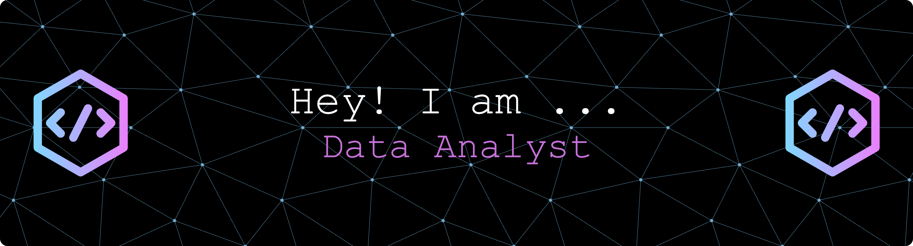

## 👩‍💻 About Me

I bring 3+ years of **software development experience** into the world of **data analytics and machine learning**. Now pursuing my **Master’s in Data Science**, I focus on bridging code and data to create impactful, data-driven solutions.

---

### 🧩 Skills Overview

#### 💻 Programming & Frameworks

#### 🧠 Data & Analytics

#### ☁️ Cloud & DevOps

#### 🧰 Tools & Others

---

### 🚀 Current Focus
- 🔭 Currently developing and optimizing **data pipelines** and **ETL workflows** using Python and SQL.  
- 🌱 Expanding knowledge in **machine learning**, **AWS Cloud**, and **data-driven automation**.  
- 👯 Open to collaborating on **data analytics or ML-focused open-source projects**.  
- 📫 Reach me at: [drashtipshah23@gmail.com](mailto:drashtipshah23@gmail.com)  
- ⚡ Fun fact: I see data as modern art — every dataset tells a story when visualized right!

---

### 🏆 GitHub Achievements

---

### 🏆 Achievements & Certifications
- IBM Certified: Machine Learning with Python  
- IBM Certified: Data Analysis with Python  
- AWS Cloud Practitioner (in progress)  
- Summa Cum Laude Graduate, San Francisco State University (GPA 3.89)

---

### 🌐 Connect With Me

---

### 📊 GitHub Stats

<!--
**DrashtiShah23/DrashtiShah23** is a ✨ _special_ ✨ repository because its `README.md` (this file) appears on your GitHub profile.

Here are some ideas to get you started:

- 🔭 I’m currently working on ...
- 🌱 I’m currently learning ...
- 👯 I’m looking to collaborate on ...
- 🤔 I’m looking for help with ...
- 💬 Ask me about ...
- 📫 How to reach me: ...
- 😄 Pronouns: ...
- ⚡ Fun fact: ...
-->
