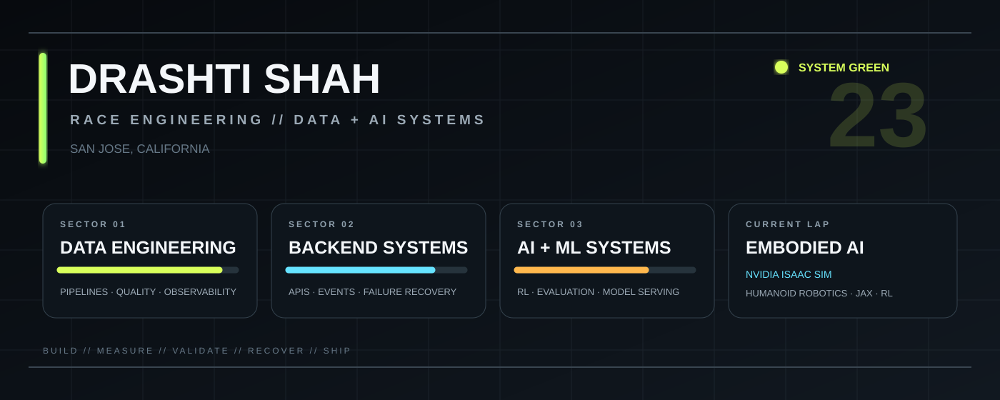
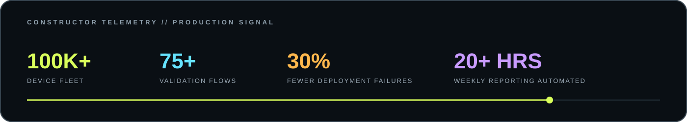
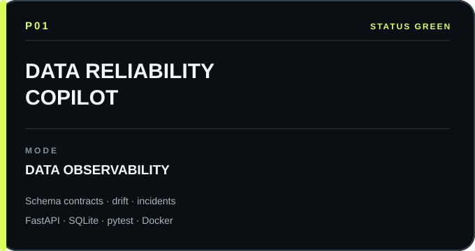
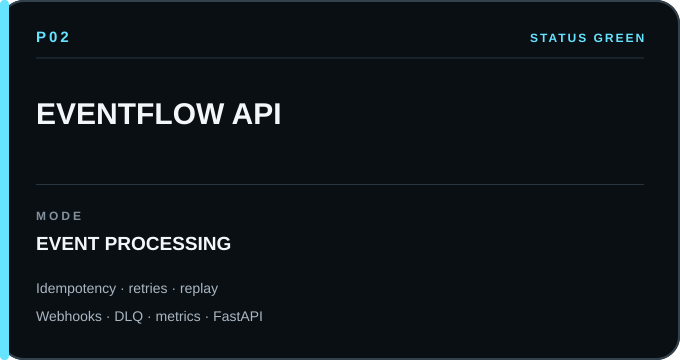
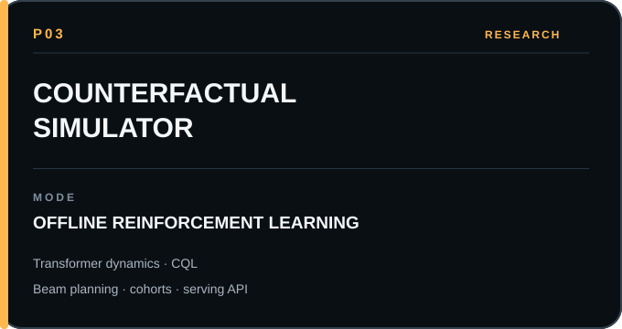
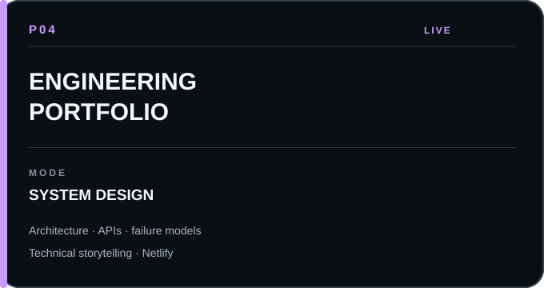
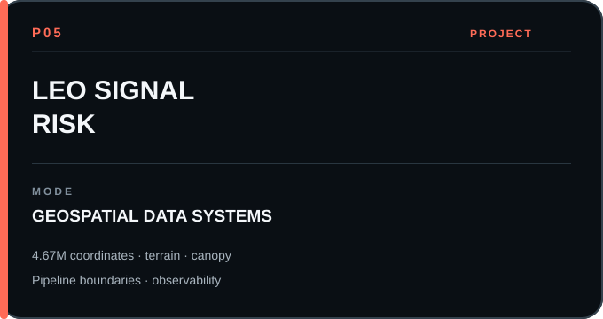
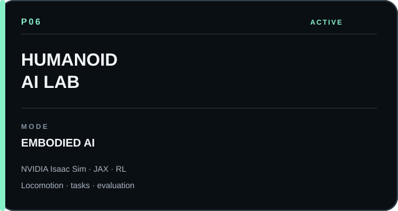
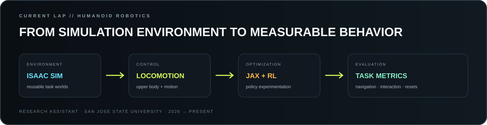

  

  
  
  

  <b>Production engineering foundation. Data and AI systems focus. Humanoid robotics research.</b>

 

  

 

<h2 align="center">STARTING GRID</h2>

<table>
<tr>
<td width="50%" align="center">

</td>
<td width="50%" align="center">

</td>
</tr>

<tr>
<td width="50%" align="center">

</td>
<td width="50%" align="center">

</td>
</tr>

<tr>
<td width="50%" align="center">

</td>
<td width="50%" align="center">

</td>
</tr>
</table>

  Open a linked system to inspect the implementation, API surface, tests, architecture, and failure handling.

 

  

 

<h2 align="center">GARAGE STACK</h2>

  
  
  
  
  
  
  
  

  <b>DATA</b> · ETL · ELT · Snowflake · PostgreSQL · MySQL · Pandas · schema validation · drift detection
   
  <b>AI</b> · PyTorch · TensorFlow · JAX · reinforcement learning · RAG · LangChain · LlamaIndex
   
  <b>BACKEND</b> · FastAPI · REST · Pydantic · SQLAlchemy · microservices · webhooks · typed contracts
   
  <b>RELIABILITY</b> · pytest · CI/CD · Docker · Kubernetes · observability · regression testing · failure recovery

 

<h2 align="center">TEAM RADIO</h2>

  I am interested in engineering roles where data systems, backend reliability, machine learning, and applied AI meet real operational constraints.

  <a href="https://drashtishah.netlify.app"><b>PORTFOLIO</b></a>
  &nbsp;&nbsp;•&nbsp;&nbsp;
  <a href="https://www.linkedin.com/in/dshah5"><b>LINKEDIN</b></a>
  &nbsp;&nbsp;•&nbsp;&nbsp;
  <a href="mailto:drashtipshah23@gmail.com"><b>EMAIL</b></a>

  CAR 23 · DATA SYSTEMS · AI SYSTEMS · EMBODIED AI · STATUS GREEN

