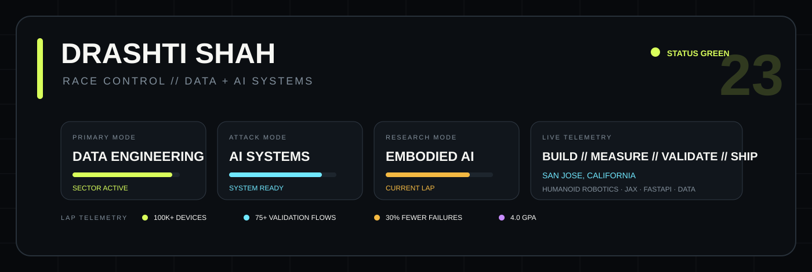

  

<h1 align="center">DRASHTI SHAH</h1>

  <b>DATA ENGINEERING</b>
  &nbsp;•&nbsp;
  <b>AI SYSTEMS</b>
  &nbsp;•&nbsp;
  <b>ML ENGINEERING</b>
  &nbsp;•&nbsp;
  <b>BACKEND ENGINEERING</b>

  San Jose, California
  &nbsp;|&nbsp;
  Humanoid Robotics Research
  &nbsp;|&nbsp;
  Production Systems Engineering

  
  
  

 

## 🏁 RACE CONTROL

<pre>
CAR              23
DRIVER           DRASHTI SHAH
BASE             SAN JOSE, CA

PRIMARY MODE     DATA ENGINEERING
ATTACK MODE      AI SYSTEMS
RESEARCH MODE    EMBODIED AI
CURRENT LAP      HUMANOID ROBOTICS

SYSTEM STATUS    GREEN
</pre>

I build production minded data, AI, ML, and backend systems with an emphasis on reliability, observability, typed interfaces, evaluation, and failure handling.

My background combines large scale production engineering with current research in humanoid robotics and embodied intelligence.

 

## 🏎️ STARTING GRID

<table>
<tr>
<td width="33%" valign="top">

### P01

## DATA RELIABILITY COPILOT

`STATUS GREEN`

**MODE**

Data Observability

**INTERFACE**

REST API

**TESTS**

6 passing

**CORE SYSTEMS**

Schema profiling

Contract validation

Distribution drift

Incident lifecycle

Run history

Reliability metrics

[OPEN SYSTEM](https://github.com/DrashtiShah23/data-reliability-copilot)

</td>
<td width="33%" valign="top">

### P02

## EVENTFLOW API

`STATUS GREEN`

**MODE**

Event Processing

**DELIVERY**

At least once

**RECOVERY**

Retry and DLQ

**TESTS**

11 passing

**CORE SYSTEMS**

Idempotent ingestion

Webhook fanout

Event replay

Retry state

Dead letter recovery

Operational metrics

[OPEN SYSTEM](https://github.com/DrashtiShah23/eventflow-api)

</td>
<td width="33%" valign="top">

### P03

## COUNTERFACTUAL SIMULATOR

`STATUS RESEARCH`

**MODE**

Offline Reinforcement Learning

**POLICY**

CQL

**PLANNING**

Beam Search

**TESTS**

11 passing

**CORE SYSTEMS**

Transformer dynamics

Conservative Q Learning

Counterfactual rollouts

Policy comparison

Cohort evaluation

Serving API

[OPEN SYSTEM](https://github.com/DrashtiShah23/counterfactual-customer-simulator)

</td>
</tr>
</table>

<table>
<tr>
<td width="33%" valign="top">

### P04

## ENGINEERING PORTFOLIO

`STATUS LIVE`

**MODE**

System Design

**DEPLOYMENT**

Netlify

**FOCUS**

Architecture

API design

Failure models

Data models

Reliability

Technical storytelling

[OPEN SYSTEM](https://github.com/DrashtiShah23/portfolio)

</td>
<td width="33%" valign="top">

### P05

## LEO SIGNAL RISK

`STATUS PROJECT`

**MODE**

Geospatial Data Systems

**SCALE**

4.67M coordinates

**CORE SYSTEMS**

Terrain processing

Canopy analysis

Land cover

Agent orchestration

Pipeline observability

Airflow boundaries

</td>
<td width="33%" valign="top">

### P06

## HUMANOID AI LAB

`STATUS ACTIVE`

**MODE**

Embodied AI

**ENVIRONMENT**

NVIDIA Isaac Sim

**OPTIMIZATION**

JAX

**CORE SYSTEMS**

Humanoid simulation

Locomotion

Task scenarios

Sensor integration

Policy optimization

Quantitative evaluation

</td>
</tr>
</table>

<table>
<tr>
<td width="33%" valign="top">

### P07

## THE LAST DEGREE

`STATUS PROJECT`

**MODE**

GenAI and Data

**CORE SYSTEMS**

RAG

Snowflake

Airflow

SQL generation

Foundation model evaluation

Data integrity

</td>
<td width="33%" valign="top">

### P08

## DEVICE VALIDATION PLATFORM

`STATUS PRODUCTION`

**MODE**

Reliability Automation

**SCALE**

100K+ devices

**IMPACT**

30% fewer deployment failures

75+ validation workflows

Python automation

CI/CD

FastAPI metrics

</td>
<td width="33%" valign="top">

### P09

## DATA AUTOMATION PIPELINES

`STATUS PRODUCTION`

**MODE**

Data Engineering

**IMPACT**

20+ hours weekly manual reporting removed

**CORE SYSTEMS**

ETL

Analytics

Operational reporting

Pipeline automation

Data validation

Metrics

</td>
</tr>
</table>

 

## 📡 PIT WALL TELEMETRY

<pre>
┌──────────────────────────── LIVE TELEMETRY ─────────────────────────────┐
│                                                                        │
│  PYTHON            ████████████████████████     PRODUCTION SYSTEMS     │
│  SQL               ███████████████████████░     DATA PIPELINES         │
│  FASTAPI           ██████████████████████░░     BACKEND SERVICES       │
│  AIRFLOW           ████████████████████░░░░     ORCHESTRATION          │
│  PYTORCH           ███████████████████░░░░░     MACHINE LEARNING       │
│  JAX               ██████████████████░░░░░░     RESEARCH               │
│  DOCKER            █████████████████████░░░     INFRASTRUCTURE         │
│                                                                        │
└────────────────────────────────────────────────────────────────────────┘
</pre>

 

## 🟢 PERFORMANCE TELEMETRY

<table>
<tr>
<td align="center" width="20%"><h3>100K+</h3>DEVICES SUPPORTED</td>
<td align="center" width="20%"><h3>75+</h3>VALIDATION FLOWS</td>
<td align="center" width="20%"><h3>30%</h3>FEWER FAILURES</td>
<td align="center" width="20%"><h3>20+ HRS</h3>WEEKLY AUTOMATED</td>
<td align="center" width="20%"><h3>4.0</h3>MS GPA</td>
</tr>
</table>

 

## 🧠 CURRENT LAP

<pre>
SESSION          HUMANOID ROBOTICS
ENVIRONMENT      NVIDIA ISAAC SIM
OPTIMIZATION     JAX
LEARNING         REINFORCEMENT LEARNING
CONTROL          LOCOMOTION + UPPER BODY
TASKS            NAVIGATION + INTERACTION
EVALUATION       QUANTITATIVE
STATUS           ACTIVE
</pre>

Current research focuses on reusable humanoid simulation environments, locomotion and upper body control, policy optimization, task design, sensors, and quantitative evaluation.

 

## 🧰 GARAGE

<table>
<tr>
<td width="20%" valign="top">

### DATA

Python

SQL

Pandas

NumPy

Airflow

Snowflake

PostgreSQL

MySQL

ETL

ELT

</td>
<td width="20%" valign="top">

### AI

PyTorch

TensorFlow

Scikit Learn

JAX

Transformers

RAG

LangChain

LlamaIndex

Reinforcement Learning

</td>
<td width="20%" valign="top">

### BACKEND

FastAPI

REST

Pydantic

SQLAlchemy

APIs

Webhooks

Microservices

Typed contracts

</td>
<td width="20%" valign="top">

### INFRA

Docker

Kubernetes

Jenkins

CI/CD

AWS

Azure

GCP

GitHub Actions

</td>
<td width="20%" valign="top">

### RELIABILITY

pytest

Schema validation

Observability

Drift detection

Regression testing

Failure recovery

Evaluation

Data integrity

</td>
</tr>
</table>

 

## 🏆 RACE HISTORY

<pre>
2026 → PRESENT

SAN JOSE STATE UNIVERSITY

RESEARCH ASSISTANT
HUMANOID ROBOTICS + EMBODIED AI

2023 → 2025

CHARTER COMMUNICATIONS

SOFTWARE ENGINEER
DEVICE AUTOMATION + VALIDATION ANALYTICS
</pre>

 

## ⚙️ ENGINEERING PHILOSOPHY

<table>
<tr>
<td width="25%" valign="top">

### 01

**DESIGN FOR FAILURE**

Retries, degraded states, validation, observability, and recovery belong in the first design.

</td>
<td width="25%" valign="top">

### 02

**MEASURE THE SYSTEM**

If system behavior cannot be measured, it is difficult to trust and harder to improve.

</td>
<td width="25%" valign="top">

### 03

**EXPLICIT INTERFACES**

Typed contracts and clear boundaries reduce ambiguity between systems and teams.

</td>
<td width="25%" valign="top">

### 04

**KEEP PROTOTYPES HONEST**

Separate what is implemented, what is measured, and what belongs to the scaling path.

</td>
</tr>
</table>

 

## 📻 TEAM RADIO

<pre>
PORTFOLIO     https://drashtishah.netlify.app
GITHUB        https://github.com/DrashtiShah23
LINKEDIN      https://www.linkedin.com/in/dshah5
EMAIL         drashtipshah23@gmail.com
LOCATION      San Jose, California
</pre>

  <b>CAR 23 // DATA + AI SYSTEMS // STATUS GREEN</b>

