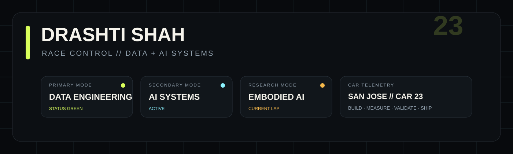
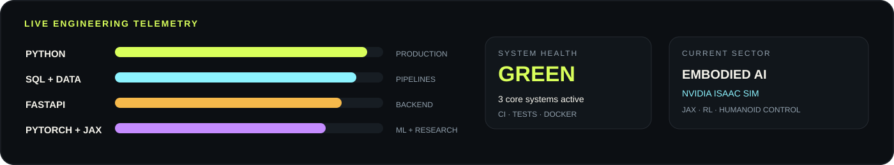

<p align="center">
  
</p>

<p align="center">
  <a href="https://drashtishah.netlify.app">
    
  </a>
  <a href="https://github.com/DrashtiShah23">
    
  </a>
  <a href="https://www.linkedin.com/in/dshah5">
    
  </a>
</p>

<p align="center">
  <b>DATA ENGINEERING</b>
  &nbsp;&nbsp;•&nbsp;&nbsp;
  <b>AI SYSTEMS</b>
  &nbsp;&nbsp;•&nbsp;&nbsp;
  <b>ML ENGINEERING</b>
  &nbsp;&nbsp;•&nbsp;&nbsp;
  <b>BACKEND ENGINEERING</b>
</p>

<br>

<p align="center">
  
</p>

## RACE CONTROL

I build production minded data, AI, ML, and backend systems with an emphasis on reliability, observability, typed interfaces, evaluation, and failure handling.

My engineering background started in large scale network automation and validation. I now work across embodied AI research, reinforcement learning, data reliability, backend architecture, and production style AI systems.

<table>
<tr>
<td width="25%"><b>CURRENT LAP</b><br>Humanoid Robotics</td>
<td width="25%"><b>SIMULATION</b><br>NVIDIA Isaac Sim</td>
<td width="25%"><b>OPTIMIZATION</b><br>JAX</td>
<td width="25%"><b>LOCATION</b><br>San Jose, CA</td>
</tr>
</table>

<br>

## GRID POSITION

<table>
<tr>
<td width="33%" valign="top">

### 01 // DATA RELIABILITY COPILOT

**STATUS** `GREEN`

**MODE** Data Observability

**INTERFACE** REST API

**TESTS** 6 passing

**CORE SYSTEMS**

Schema profiling  
Contract validation  
Distribution drift  
Incident lifecycle  
Run history  
Reliability metrics

[OPEN REPOSITORY](https://github.com/DrashtiShah23/data-reliability-copilot)

</td>
<td width="33%" valign="top">

### 02 // EVENTFLOW API PLATFORM

**STATUS** `GREEN`

**MODE** Event Processing

**DELIVERY** At least once

**RECOVERY** Retry + DLQ

**TESTS** 11 passing

**CORE SYSTEMS**

Idempotent ingestion  
Webhook fanout  
Replay  
Retry state  
Dead letter recovery  
Operational metrics

[OPEN REPOSITORY](https://github.com/DrashtiShah23/eventflow-api)

</td>
<td width="33%" valign="top">

### 03 // COUNTERFACTUAL SIMULATOR

**STATUS** `RESEARCH`

**MODE** Offline RL

**POLICY** CQL

**PLANNING** Beam Search

**TESTS** 11 passing

**CORE SYSTEMS**

Transformer dynamics  
Conservative Q Learning  
Counterfactual rollouts  
Policy comparison  
Cohort evaluation  
Serving API

[OPEN REPOSITORY](https://github.com/DrashtiShah23/counterfactual-customer-simulator)

</td>
</tr>
</table>

<table>
<tr>
<td width="33%" valign="top">

### 04 // ENGINEERING PORTFOLIO

**STATUS** `LIVE`

**MODE** System Design

**DEPLOYMENT** Netlify

**FOCUS**

Architecture case studies  
API surfaces  
Failure models  
Data models  
Technical storytelling  
Visual systems design

[OPEN REPOSITORY](https://github.com/DrashtiShah23/portfolio)

</td>
<td width="33%" valign="top">

### 05 // LEO SIGNAL RISK SYSTEM

**STATUS** `PROJECT`

**MODE** Geospatial Data

**SCALE** 4.67M coordinates

**FOCUS**

Terrain slope  
Canopy density  
Land cover  
Agent orchestration  
Pipeline observability  
Airflow ready boundaries

**REPOSITORY STATUS** Add public repo link when published

</td>
<td width="33%" valign="top">

### 06 // HUMANOID AI LAB

**STATUS** `ACTIVE RESEARCH`

**MODE** Embodied AI

**ENVIRONMENT** Isaac Sim

**OPTIMIZATION** JAX

**FOCUS**

Humanoid simulation  
Locomotion  
Task design  
Sensors  
Policy optimization  
Quantitative evaluation

**RESEARCH SYSTEM**

</td>
</tr>
</table>

<table>
<tr>
<td width="33%" valign="top">

### 07 // THE LAST DEGREE

**STATUS** `PROJECT`

**MODE** GenAI + Data

**FOCUS**

RAG  
Snowflake  
Airflow  
SQL generation  
Foundation model evaluation  
Data integrity

**REPOSITORY STATUS** Add public repo link when published

</td>
<td width="33%" valign="top">

### 08 // DEVICE VALIDATION PLATFORM

**STATUS** `PRODUCTION EXPERIENCE`

**MODE** Reliability Automation

**SCALE** 100K+ devices

**IMPACT**

30% fewer deployment failures  
75+ validation workflows  
Python automation  
CI/CD  
Regression testing  
FastAPI metrics

**PRODUCTION SYSTEM**

</td>
<td width="33%" valign="top">

### 09 // DATA AUTOMATION PIPELINES

**STATUS** `PRODUCTION EXPERIENCE`

**MODE** Data Engineering

**IMPACT**

20+ hours weekly manual work removed

**FOCUS**

ETL  
Reporting automation  
Analytics  
Operational metrics  
Data quality  
Leadership reporting

**PRODUCTION SYSTEM**

</td>
</tr>
</table>

<br>

## PIT WALL TELEMETRY

<p align="center">
  
</p>

<br>

## SYSTEM STACK

<table>
<tr>
<td width="20%" valign="top">

### DATA

Python  
SQL  
Pandas  
NumPy  
Airflow  
Snowflake  
PostgreSQL  
MySQL  
ETL / ELT

</td>
<td width="20%" valign="top">

### AI + ML

PyTorch  
TensorFlow  
Scikit Learn  
JAX  
Transformers  
Reinforcement Learning  
RAG  
LangChain  
LlamaIndex

</td>
<td width="20%" valign="top">

### BACKEND

FastAPI  
REST APIs  
Pydantic  
SQLAlchemy  
Async workflows  
API contracts  
Webhook systems  
Microservices

</td>
<td width="20%" valign="top">

### INFRA

Docker  
Kubernetes  
Jenkins  
CI/CD  
AWS  
Azure  
GCP  
GitHub Actions

</td>
<td width="20%" valign="top">

### RELIABILITY

pytest  
Schema validation  
Data integrity  
Observability  
Regression testing  
Drift detection  
Failure recovery  
System evaluation

</td>
</tr>
</table>

<br>

## CURRENT LAP // EMBODIED AI

```text
SESSION          HUMANOID ROBOTICS
ENVIRONMENT      NVIDIA ISAAC SIM
OPTIMIZATION     JAX
CONTROL          LOCOMOTION + UPPER BODY
TASKS            NAVIGATION + INTERACTION
EVALUATION       QUANTITATIVE
STATUS           ACTIVE
```

Current research focuses on reusable humanoid simulation environments, policy optimization, task scenarios, sensors, motion policies, and stable embodied AI experimentation.

<br>

## RACE HISTORY

```text
2026 → PRESENT
SAN JOSE STATE UNIVERSITY
Research Assistant
Humanoid Robotics + Embodied AI

2023 → 2025
CHARTER COMMUNICATIONS
Software Engineer
Device Automation + Validation Analytics
```

<br>

## ENGINEERING PRINCIPLES

<table>
<tr>
<td width="25%" valign="top"><b>01 // DESIGN FOR FAILURE</b><br><br>Retries, degraded states, validation, observability, and recovery paths belong in the first design.</td>
<td width="25%" valign="top"><b>02 // MEASURE THE SYSTEM</b><br><br>If behavior cannot be measured, it is difficult to trust and harder to improve.</td>
<td width="25%" valign="top"><b>03 // EXPLICIT INTERFACES</b><br><br>Typed contracts and clear boundaries reduce ambiguity between systems and teams.</td>
<td width="25%" valign="top"><b>04 // KEEP PROTOTYPES HONEST</b><br><br>Separate what is implemented, what is measured, and what belongs to the scaling path.</td>
</tr>
</table>

<br>

## CONTACT RADIO

```text
PORTFOLIO     https://drashtishah.netlify.app
GITHUB        https://github.com/DrashtiShah23
LINKEDIN      https://www.linkedin.com/in/dshah5
EMAIL         drashtipshah23@gmail.com
LOCATION      San Jose, California
```

<p align="center">
  <sub>CAR 23 // DATA + AI SYSTEMS // STATUS GREEN</sub>
</p>
